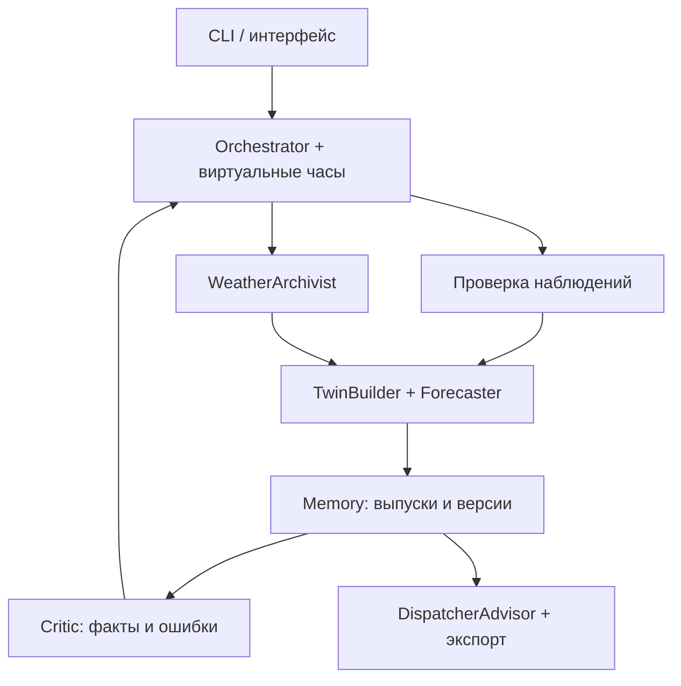

# TwinTurbo.ai

**Агентный почасовой прогноз выработки двух ветровых турбин на 24–48 часов с воспроизводимым историческим replay.**

Трек: энергетика, HackAlem AI. Рабочая спецификация: 23 сентября 2026 года.

> **Статус документа:** готовое задание для реализации и основа README для жюри. Исходные CSV проверены, архитектура и критерии приёмки определены. Код приложения, погодный коннектор, обученные модели и deployed-версия в рамках этой подготовки не созданы. Команды ниже задают интерфейс, который предстоит реализовать; их успешный запуск пока не подтверждён. Перед сдачей команда обязана обновить статусы по фактическим результатам. Не заменять «планируется» на «реализовано» без работающего сценария.

## 1. Название проекта

**WindOracle — прогноз ВЭС с памятью о данных, прогнозах и ошибках.**

Ключевая идея: воспроизвести каждый прогноз так, как он мог быть сформирован в прошлом, показать диапазон неопределённости и пересчитать результат при поступлении нового погодного запуска.

## 2. Какую проблему решает проект

Пользователь — диспетчер или аналитик оператора ВЭС. Для планирования ему нужны почасовая мощность на следующие двое суток, сведения о свежести прогноза и объяснение изменений между выпусками.

WindOracle проектируется для следующего сценария: оператор выбирает момент выпуска, получает прогноз по двум турбинам, проверяет использованный погодный run и видит, как изменился результат после нового run. Когда поступают фактические измерения, система оценивает ошибку и может обновить коррекцию.

Практическая ценность MVP:

- почасовой прогноз и выгрузка для планирования;
- прослеживаемость каждого результата до доступных тогда входных данных;
- измеримое качество на историческом периоде;
- автоматический повторный расчёт с сохранением старых версий;
- явное отображение отсутствующих данных, устаревшей телеметрии и неопределённости.

Эффект в деньгах и повышение точности пока не измерены. Мы не заявляем внедрение у оператора или подтверждённую экономию.

## 3. Что реализовано и что входит в MVP

### Текущий подтверждённый результат

- Прочитано ТЗ энергетического трека.
- Проверены два CSV: схема, число записей, диапазон дат, повторы, пропуски временной сетки, границы мощности.
- Определены протокол replay, контракты компонентов, схема проверки и порядок реализации.
- Подготовлен этот README. Работоспособность программных функций ещё не подтверждена.

### Реестр функций

| Функция | Приоритет | Статус | Условие готовности |
| --- | --- | --- | --- |
| Импорт двух CSV и отчёт о качестве | P0 | К реализации | Повторяет контрольные числа из раздела 9 |
| Получение архивного погодного run по координатам | P0 | Источник требует проверки | Скачан реальный run нужной даты; доказано происхождение |
| Контроль времени доступности | P0 | К реализации | Поздние данные не влияют на прошлый прогноз |
| Физически ограниченный базовый прогноз | P0 | К реализации | 48 часовых значений на турбину, все в [0, 1] |
| Replay, сохранение выпусков, пересчёт при новом run | P0 | К реализации | Повторный выпуск связан с предыдущим, история сохранена |
| Интерфейс и экспорт | P0 | К реализации | Жюри повторяет сценарий из раздела 8 |
| Сравнение с baseline на историческом периоде | P0 | К реализации | Метрики, число оцениваемых часов, происхождение входов |
| ML и подбор ансамбля по горизонту | P1 | К реализации | Прирост проверен на последовательной валидации |
| Q10 / Q50 / Q90 | P1 | К реализации | Измерены покрытие, ширина и pinball loss |
| Online bias correction | P1 | К реализации | Январский replay с коррекцией и без неё |
| Автоматическое принятие/отклонение новой модели | P2 | Вне обязательного MVP | Есть отдельная проверка кандидата и откат |
| Сценарий доступности турбины | P2 | Опционально | Отделён от фактического прогноза и не меняет его |
| Экономический симулятор | P2 | Опционально | Есть единицы, мощности и явные допущения стоимости |
| 3D, wake-модель, инженерный цифровой двойник | P2 | Вне MVP | Нужны геометрия и технические характеристики |

**Правило приоритета:** сначала закончить P0. Реализовывать P1 по одному и сохранять только проверенные улучшения. P2 не должен задерживать обязательный сценарий.

## 4. Как работает решение

### Основной пользовательский сценарий

1. Пользователь загружает CSV двух турбин и подтверждённую конфигурацию площадки.
2. Система проверяет данные и формирует почасовые наблюдения.
3. Пользователь выбирает исторический момент выпуска и горизонт 24 или 48 часов.
4. WeatherArchivist получает или читает из кэша допустимый архивный погодный run.
5. Forecaster вычисляет почасовую нормализованную мощность по каждой турбине.
6. Пользователь видит график, источник погоды, возраст run, версию модели и статус входных данных. При готовности P1 доступны Q10/Q50/Q90.
7. Появление нового допустимого run запускает пересчёт. Старый выпуск сохраняется; интерфейс показывает разницу.
8. Когда становится доступен факт, Critic считает ошибку. В адаптивном режиме обновляется bias; без факта обновление пропускается с понятной причиной.
9. Пользователь экспортирует прогноз и журнал происхождения данных.

### Три отдельных режима

| Режим | Назначение | Правила |
| --- | --- | --- |
| `replay` | Проверка на истории, например январь 2026 | Виртуальные часы; факты открываются постепенно |
| `submission` | Прогнозы на февраль 2026 | Только архивные runs; доступных февральских фактов сейчас нет |
| `fixture` | Тест интерфейса и отказов без сети | Синтетические данные явно помечены; конкурсный экспорт запрещён |

Отдельно поддержать offline-повторение **реального** replay из заранее скачанного кэша. Это не fixture и не новое получение погоды. Коннектор скачивания должен быть показан хотя бы в одном проверенном online-сценарии.

### Экран MVP

- Селекторы турбины, даты выпуска, горизонта и режима.
- График: прогноз; факт только там, где он уже доступен; интервал только при готовой оценке неопределённости.
- Карточки: погодная модель, run, время доступности, возраст телеметрии, версия прогноза.
- Таблица сравнения двух выпусков для совпадающих целевых часов.
- Панель качества: MAE/RMSE на проверочном периоде; покрытие данных; P1 — покрытие интервала.
- Журнал действий агентов и кнопка выгрузки CSV.
- Условная схема двух турбин. Называть её схемой, пока нет подтверждённых географических координат.

Не показывать выдуманный процент «доверия AI». Отдельно показывать свежесть входов, ширину интервала и историческое качество на сравнимом горизонте.

## 5. Технологии

Выбран компактный Python-стек для реализации на CPU. Это проектный выбор, а не список уже установленных зависимостей.

| Задача | Выбор |
| --- | --- |
| Язык | Python 3.11 |
| Таблицы и численные расчёты | pandas, NumPy |
| Базовая модель и ML | scikit-learn: бинированная кривая, HistGradientBoostingRegressor |
| Интервалы P1 | Эмпирические квантили прошлых ошибок; при наличии времени — quantile regression |
| Контракты и конфигурация | Pydantic, PyYAML |
| Командный интерфейс | Typer |
| UI и графики | Streamlit, Plotly |
| Погодный коннектор | httpx; один подтверждённый источник operational runs |
| Работа с GRIB, если выбран такой архив | Опциональный extra: xarray, cfgrib, ecCodes |
| Хранение | Parquet/pyarrow для данных; SQLite для выпусков и событий; joblib для доверенных локальных моделей |
| Проверки | pytest |
| Воспроизводимость | Зафиксированные зависимости, seed=42, хеши конфигурации/данных, Git commit |

Оркестрация — явная машина состояний в одном процессе. Для MVP не нужны отдельные микросервисы, Kafka, векторная БД или GPU.

Численные модели — ML/статистические модели. LLM не вычисляет мощность и не выбирает произвольные веса. Опциональный LLM может объяснять готовый структурированный результат; при его отсутствии работает шаблонное объяснение. Пока LLM не подключён, не заявлять LLM-agent или шесть независимых LLM-агентов.

Перед релизом разработчик должен зафиксировать реально проверенные версии в `requirements.lock` и отдельно указать лицензии сторонних компонентов. Не копировать в lock неподтверждённые номера версий.

## 6. Архитектура проекта

### Компоненты



| Компонент | Ответственность | Граница полномочий |
| --- | --- | --- |
| Orchestrator | Порядок действий, события, retry, идентификаторы задач | Все обращения к данным проходят через `as_of` |
| WeatherArchivist | Загрузка, происхождение, выбор допустимого run | Не подменяет прогноз наблюдениями или реанализом |
| TwinBuilder | Отдельная эмпирическая кривая мощности каждой турбины | Не объявляет неизвестные характеристики восстановленными |
| Forecaster | Признаки, прогноз, ансамбль, ограничения выхода | Использует только активные на момент выпуска версии |
| Critic | Ошибки, bias, сигналы ухудшения, оценка кандидата | Не меняет старые прогнозы и не обучается на будущем |
| DispatcherAdvisor | Представление результата, объяснение, сценарии | Не управляет настоящей ВЭС |
| Memory | Наблюдения, runs, прогнозы, метрики, версии, журнал | Сырые данные и опубликованные выпуски неизменяемы |

Agentic-цикл должен иметь реальные решения: выбрать допустимый run, отклонить поздний, повторить запрос после временного сбоя, применить разрешённый fallback, инициировать пересчёт, пропустить коррекцию без факта. Имена классов сами по себе не доказывают агентность. В журнале сохраняются основание, действие и результат каждого решения.

### 6.1. Временной контракт — обязательный инвариант

Для любого выпуска с `origin_time=T` все использованные данные должны удовлетворять `available_at <= T`. Для модели — `activated_at <= T`; для её обучающих целей — `label_available_at <= training_cutoff`.

Различать:

- `event_start`, `event_end`: какой интервал описывает измерение;
- `run_init_time`: инициализация погодной модели;
- `available_at`: историческая доступность конкретной записи или полного набора нужных файлов;
- `retrieved_at`: фактическое скачивание архива нашей командой;
- `origin_time`: исторический момент принятия решения;
- `created_at`: время выполнения replay сейчас;
- `target_start`, `target_end`: прогнозируемый час, полуоткрытый интервал `[start, end)`.

Все внутренние timestamps — timezone-aware UTC. Локальное время используется только для ввода, календарных признаков и вывода. CSV не содержит timezone: нельзя молча присвоить UTC или текущий пояс Казахстана всему периоду. Нужны пояс/правило часов исходной системы и учёт возможных изменений за 2023–2026 годы. Неоднозначные и несуществующие локальные времена требуют явного решения.

Время инициализации run не является временем его публикации. Если исторических логов публикации нет, задать консервативную документированную задержку и `availability_basis=estimated`. Такой backtest явно имеет допущение о задержке. Не заявлять точность воспроизведения сетевых задержек, которой нет.

### 6.2. Подготовка наблюдений

1. Сохранить исходные CSV неизменными, вычислить SHA-256.
2. Проверить уникальность `(turbine_id, raw_timestamp)`; ID из файла — только идентификатор, не признак модели.
3. Преобразовать время по подтверждённой семантике. Если метка обозначает начало десятиминутного интервала, его конец равен метке + 10 минут.
4. Для равных десятиминутных средних получить часовую мощность средним шести значений. Если это мгновенные отсчёты, назвать часовое среднее оценкой и документировать метод.
5. Полный час допускается в основную оценку только при шести уникальных валидных интервалах. Сохранить `n_samples`, `coverage`, `quality_flag`.
6. Доступность часа — не раньше его конца и поступления всех использованных измерений. При отсутствии логов использовать явную задержку доставки.
7. Пропуски не равны нулевой мощности. Не делать `backfill`, центрированные окна, интерполяцию через длительные провалы.
8. Скейлеры, заполнение признаков и калибровки обучать внутри каждого временного train-периода.

Не вычищать из оценки неудобные часы по их большой ошибке. Низкая мощность при ветре может иметь разные причины; без статусов турбин это не подтверждённый curtailment.

### 6.3. Архив погоды

Провайдер реализует `fetch_runs(site, start, end)` и `select_run(as_of, target_window)`. Выбирается самый свежий допустимый run одной явно указанной модели, покрывающий весь требуемый набор переменных и часов. При частичной публикации учитывать доступность каждого файла; для общего снимка брать максимум времени доступности необходимых файлов.

Кэш хранит исходный ответ/GRIB, модель и её версию, run, координаты запрошенной точки и выбранной ячейки, единицы, метод пространственной и временной интерполяции, URL/параметры, SHA-256 и происхождение `operational_archive` / `hindcast` / `reanalysis` / `synthetic`.

Строгий режим допускает только подтверждённый `operational_archive`. Hindcast, реанализ и fixture не являются заменой конкурсного входа.

Допустимо интерполировать 3-часовой прогноз к часовой сетке **внутри одного уже доступного run**. Это надо обозначить в метаданных. Запрещено смешивать его с будущими runs или фактической погодой. Для ветра предпочтительны компоненты u/v; усреднять направление как обычное число нельзя. За пределами покрытия run не экстраполировать молча.

Fallback: более старый допустимый run, покрывающий весь горизонт, не старше `max_run_age_hours`. Начальное допущение 24 часа, проверяемое на валидации. Если такого run нет — явный отказ `WEATHER_UNAVAILABLE`, без фальшивого прогноза. Полнота выпусков входит в отчёт.

### 6.4. Модели

**P0: объяснимая основа.** Отдельная для каждой турбины бинированная медианная кривая зависимости нормализованной мощности от измеренного ветра. Правила сглаживания и минимальное число наблюдений выбираются до контрольного периода. Возврат мощности ограничен [0, 1]. За пределами освоенного диапазона — флаг `OUT_OF_DOMAIN` и явно заданное ограниченное продолжение кривой; неизвестный cut-out не выдумывать. Если вводится монотонность, применять её только к обоснованной рабочей области, а не ко всем скоростям.

В прогнозе на вход поступает прогнозный ветер. Ошибку различий между ветром на сетке и на турбине можно корректировать по прошлым парам «архивный прогноз — измерение», не заглядывая в проверочный период. Пока такой калибровки нет, ограничение отражается в отчёте.

Температура — дополнительный статистический признак P1. Настоящая поправка на плотность требует давления и корректного температурного определения; не заявлять физическую коррекцию плотности по одной температуре. Высота ступицы неизвестна: используемый уровень погодного ветра фиксируется как вход, а не как восстановленная высота турбины.

**P1: ML.** HistGradientBoostingRegressor с абсолютной ошибкой для медианного прогноза. Признаки: прогнозные ветер/температура; при наличии направление через sin/cos, давление; горизонт WindOracle; lead погодной модели; возраст run; календарь целевого часа. Базовая ML-модель работает без свежей телеметрии. Модель с лагами допускается как отдельное улучшение при наличии измерений.

Пример обучения содержит `(turbine, historical_origin, target, selected_run, features_as_of_origin, actual_target)`. Один целевой час может иметь несколько горизонтов. Исторические прогнозные входы восстанавливаются по тому же правилу, что в replay. Данные 2023 года могут обучать эмпирическую кривую, даже если operational-погодного архива для ML за этот период нет; объёмы train для моделей указываются отдельно.

**Ансамбль P1:** `p_base = w[group] * p_ml + (1-w[group]) * p_twin`. Группы горизонтов: 1–6, 7–12, 13–24, 25–48 часов. Веса выбирать на последовательной валидации из небольшой фиксированной сетки, например {0, 0.25, 0.5, 0.75, 1}; затем заморозить для контрольного replay. Не объявлять, что физика обязательно лучше на коротком горизонте. Динамические веса — отдельный последующий эксперимент.

Q50 — медианный/базовый прогноз, не математическое ожидание. Сумма Q50 двух турбин — сумма базовых прогнозов, не гарантированная медиана суммарной мощности.

### 6.5. Коррекция и неопределённость P1

Bias оценивается по ошибкам **сохранённых out-of-sample выпусков до коррекции**: `r = actual - p_base`. Использовать один назначенный ежедневный выпуск на целевой час и группу горизонта, чтобы многочисленные пересчёты не увеличивали вес отдельных наблюдений.

Стартовый алгоритм: средняя ошибка за последние 21 день по турбине и группе горизонта, со стягиванием к общей ошибке турбины: `b_g=(n_g*mean(r_g)+lambda*b_global)/(n_g+lambda)`, `lambda=48`. Все параметры — начальные гипотезы, выбираемые на валидации. При отсутствии зрелых ошибок — `b=0`, статус `insufficient_history`. После смены базовой модели не переносить её предшественнику вычисленный bias без проверки; использовать отдельную версию состояния или сброс с обозначением прогрева.

Коррекция: `p_corrected = clip(p_base + b_g, 0, 1)`. Каждая пара прогноза и версии факта обрабатывается один раз. Новые факты обновляют только будущие выпуски. Если меняется факт, сохраняется новая версия и отдельное событие, а история не затирается.

Для простых интервалов собирать out-of-sample ошибки уже скорректированных прогнозов. Для нового выпуска прибавлять к `p_corrected` эмпирические Q10/Q50/Q90 этих ошибок по той же группе. Ограничивать значения [0, 1], проверять `q10 <= q50 <= q90`. Это эмпирические интервалы с проверяемым покрытием, а не гарантия условной вероятности. Не прибавлять bias второй раз. При недостаточной истории использовать заранее проверенный более общий пул ошибок; если его нет — интервал недоступен.

Q10–Q90 соответствует целевому покрытию 80%; измерять его на будущих относительно калибровки данных. Для разных турбин и часов ошибки зависимы: нельзя складывать их квантили и объявлять результат квантилем суммарной энергии. Интервалы для станции и суток требуют совместных траекторий, например блочного bootstrap парных ошибок; это вне P0.

Разделение ещё и по часу суток, лёгкое переобучение каждые сутки и автоматический откат — P2. Для кандидата нужна отдельная более поздняя, но уже доступная на момент решения проверка. Обучить кандидата на окне и сравнить на том же окне недостаточно.

### 6.6. Расписание и порядок событий

Начальное проектное расписание: ежедневный выпуск в 23:00 подтверждённого времени площадки, прогноз на 24 или 48 полных часов начиная со следующей полуночи. Для горизонта 48 целевые начала равны `origin + 1h ... origin + 48h`, последний интервал заканчивается в `origin + 49h`. `lead_hours` определён по **началу** целевого интервала. Погодное покрытие должно учитывать используемые границы интервалов.

Это допущение расписания, не требование ТЗ; после уточнения у организатора оно меняется одним параметром. Модель на выпуск 31 января в 23:00 не имеет права использовать измерения 31 января 23:10–23:50.

В replay события обрабатываются по `(available_at, event_priority, event_id)`. На одинаковой метке времени сначала поступление данных, затем расчёт. Алгоритм одного выпуска:

1. Получить снимок доступных к `origin_time` входов.
2. Оценить зрелые ошибки прошлых выпусков; обновить разрешённое состояние.
3. Выбрать активную модель, подготовленную по допустимому cutoff.
4. Выбрать погодный run, проверить покрытие и происхождение.
5. Собрать признаки и выпустить прогноз.
6. Атомарно сохранить прогноз, manifest и событие публикации.

Переобучение имеет время завершения и активации. В replay нельзя мгновенно активировать модель, которая в реальном сценарии ещё обучалась бы; задать и зафиксировать задержку вычисления либо явно обозначить упрощение симуляции.

События нового run создают отдельные выпуски `release_kind=update`. Основной ежедневный выпуск имеет `release_kind=scheduled`. Для сравнений качества использовать одинаковую политику выпусков у всех моделей. Обновления не заменяют ежедневные прогнозы задним числом.

### 6.7. Контракты хранения

| Набор | Основные поля |
| --- | --- |
| `observations` | turbine_id, event_start/end, available_at, power_norm, wind_ms, temperature_c, coverage, quality_flag, revision |
| `weather_runs` | run_id, provider, model, model_version, run_init_time, available_at, availability_basis, provenance, retrieved_at, sha256 |
| `weather_values` | run_id, turbine_id, valid_time, wind_ms, temperature_c, optional variables, units, interpolation |
| `model_versions` | model_id, train_start, training_cutoff, max_label_available_at, activated_at, config_hash, data_hash, git_commit |
| `bias_versions` | bias_id, model_id, created_as_of, last_actual_available_at, error_window, parameters, sample_counts |
| `forecasts` | forecast_id, turbine_id, origin_time, target_start/end, lead_hours, weather_lead_hours, run_id, model_id, bias_id, p_base, p_corrected, q10/q50/q90, status, parent_forecast_id |
| `agent_events` | event_id, event_time, agent, action, reason_code, input_ids, output_ids, status, duration_ms |

Квантили nullable до реализации P1. Точечный прогноз существует отдельно и не дублируется в три одинаковые колонки под видом неопределённости.

Ключ идемпотентности включает origin, турбину, run, горизонт, версии модели/bias и конфигурацию. Повтор команды не создаёт дубликаты. Ошибки сети — не более трёх попыток с ограниченной задержкой; после этого допустимый fallback или явный отказ. Журнал не содержит ключей API.

### 6.8. Предлагаемая структура репозитория

| Путь | Назначение |
| --- | --- |
| `README.md` | Этот документ, затем актуальная инструкция релиза |
| `pyproject.toml`, `requirements.lock` | Пакет и проверенные зависимости |
| `configs/site.example.yaml` | Конфигурация с явными незаполненными полями |
| `configs/site.yaml` | Рабочая подтверждённая конфигурация |
| `src/windoracle/cli.py` | Команды из разделов 7–8 |
| `src/windoracle/schemas.py`, `clock.py`, `store.py` | Контракты, время, хранение |
| `src/windoracle/ingest.py`, `features.py` | Наблюдения и признаки as-of |
| `src/windoracle/weather/` | Интерфейс, выбранный адаптер, кэш, provenance |
| `src/windoracle/models/` | Baseline, кривая, ML, ансамбль, интервалы, bias |
| `src/windoracle/agents/` | Orchestrator, Archivist, Critic, Advisor |
| `src/windoracle/replay.py`, `evaluate.py`, `export.py` | Исторический прогон и отчёты |
| `app.py` | Streamlit UI, вызывающий общий сервисный слой |
| `tests/` | Временные инварианты, схемы, end-to-end |
| `data/raw/`, `data/weather/`, `data/processed/` | Исходники, погодный кэш, подготовленные данные |
| `artifacts/`, `reports/`, `outputs/` | Версии моделей, метрики, прогнозы |
| `demo/manifest.json` | Реальный воспроизводимый пакет для жюри после подготовки |

Не хранить огромный погодный архив в Git. Сохранить проверяемый небольшой demo-пакет, если разрешено его распространение; иначе — скрипт получения, контрольные суммы и требования доступа.

## 7. Установка и запуск

> Ниже целевой контракт запуска будущего репозитория. Сейчас код для этих команд не создан. Codex должен реализовать команды буквально либо синхронно обновить примеры. Раздел становится проверенной инструкцией только после запуска из чистой среды.

### Предварительные условия

- Python 3.11, Git, CPU; GPU не требуется.
- Репозиторий команды и два исходных CSV.
- Подтверждённые координаты, часовой пояс, смысл временных меток.
- Рабочий доступ к выбранному погодному архиву; для offline-demo — готовый реальный кэш.
- Для GRIB-провайдера дополнительные зависимости должны устанавливаться через проверенный extra `weather-grib` и быть описаны после выбора источника.

После клонирования предоставленного командой репозитория открыть его корень. Реальный URL репозитория ещё не предоставлен и здесь не выдумывается.

```bash
python -m venv .venv
source .venv/bin/activate
python -m pip install -r requirements.lock
python -m pip install --no-deps -e .
cp configs/site.example.yaml configs/site.yaml
```

Windows PowerShell: вместо `source` выполнить `.venv\Scripts\Activate.ps1`; вместо `cp` можно использовать `Copy-Item`.

Скопировать исходные файлы в `data/raw/turbine_1.csv` и `data/raw/turbine_2.csv`, сохранив содержимое. Исходные имена и SHA-256 записываются при импорте. Для judge-demo пути должны быть заданы в manifest или явно описаны в релизе.

Минимальная форма конфигурации:

```yaml
site:
  timezone: null                 # подтвердить правило времени CSV
  timestamp_semantics: null      # interval_start / interval_end / instant
  observation_delay_minutes: 15  # допущение, заменить при наличии логов
  assumptions_acknowledged: false
  turbines:
    - id: turbine_1
      latitude: null
      longitude: null
      rated_power_mw: null
    - id: turbine_2
      latitude: null
      longitude: null
      rated_power_mw: null
weather:
  provider: null                 # один реально проверенный адаптер
  model: null
  provenance_required: operational_archive
  availability_policy: null      # ссылка на evidence/правило задержки
  max_run_age_hours: 24
  cache_dir: data/weather
forecast:
  issue_local_time: '23:00'
  horizon_hours: 48
  seed: 42
  mode: submission
  telemetry_features: false
  online_bias: false
storage:
  database: artifacts/windoracle.sqlite
```

`null` в обязательном поле — ошибка с названием поля. Не подставлять фиктивные координаты. Неизвестная номинальная мощность не блокирует нормализованный прогноз, но блокирует MW/MWh и экономический расчёт.

```bash
python -m windoracle doctor --config configs/site.yaml
python -m windoracle ingest --config configs/site.yaml --turbine-1 data/raw/turbine_1.csv --turbine-2 data/raw/turbine_2.csv
python -m windoracle weather fetch --config configs/site.yaml --start 2025-10-01 --end 2026-03-02
python -m windoracle weather audit --config configs/site.yaml
python -m windoracle replay --config configs/site.yaml --start 2026-01-01 --end 2026-01-30 --fit-before-first-origin --adaptation off --output outputs/january_base
python -m windoracle replay --config configs/site.yaml --start 2026-01-01 --end 2026-01-30 --fit-before-first-origin --adaptation bias --output outputs/january_bias
python -m windoracle evaluate --baseline outputs/january_base --candidate outputs/january_bias --output reports/january
python -m streamlit run app.py
```

`weather fetch --start/--end` задаёт диапазон **целевых дат**, включительно, в поясе площадки; адаптер сам получает необходимые более ранние циклы. В production-имплементации обязателен лимит объёма/план скачивания. Приведённый диапазон — первый ограниченный эксперимент, не требование скачивать все поля глобальной сетки. Для обучения и выбора настроек на более ранних месяцах кэш расширяется явно.

`replay --start/--end` задаёт даты **выпуска**, включительно. `--fit-before-first-origin` обучает начальную модель только на доступных до первого выпуска примерах и сбрасывает состояние в новом namespace эксперимента. При недостаточной погодной истории работает только честно обозначенный P0 либо команда возвращает ошибку; она не подменяет входы.

Для февраля:

```bash
python -m windoracle replay --config configs/site.yaml --start 2026-01-31 --end 2026-02-28 --fit-before-first-origin --mode submission --adaptation off --output outputs/february
python -m windoracle export --input outputs/february --target-start 2026-02-01 --target-end 2026-03-01 --release-policy scheduled --output outputs/submission.csv
```

У `export` границы целевых дат полуоткрытые: `[2026-02-01, 2026-03-01)` по времени площадки. Полные 48-часовые выпуски, уходящие в март, сохраняются внутри `outputs/february`; экспорт отбирает февраль. Формат организатора в ТЗ не указан: `submission.csv` — внутренний формат, требующий адаптера, если появится официальный шаблон.

Требуемые поля CSV: `turbine_id, origin_time, target_start, target_end, lead_hours, prediction_norm, q10, q50, q90, weather_run_id, model_version, bias_version, status`. Не выводить пустые прогнозы как нули.

## 8. Как проверить решение

### Повторяемый сценарий для жюри после реализации

Команда должна подготовить реальный demo-пакет до сдачи. В нём: конфигурация с подтверждёнными допущениями, два небольших погодных runs, необходимые исходные данные или способ доступа, обученная допустимая модель, контрольные суммы и ожидаемые инварианты. Это ещё не созданные артефакты.

```bash
python -m windoracle demo --manifest demo/manifest.json --offline --output outputs/judge
python -m windoracle verify --input outputs/judge
python -m pytest -q
python -m streamlit run app.py
```

Порядок демонстрации, ориентир 3–5 минут:

1. Открыть ежедневный выпуск 15 января 2026 года, 23:00 площадки. До проверки покрытия архива это кандидат даты; если данных нет, выбрать другую январскую дату и зафиксировать её в manifest.
2. Убедиться, что выпущено 96 строк: две турбины × 48 целевых часов; значения конечны и в [0, 1].
3. Открыть происхождение одного часа: run, время доступности, версия модели, cutoff обучения.
4. Продвинуть виртуальное время до следующего доступного run. Показать новый forecast_id, связь с предыдущим и разницу на общих целевых часах. Старый прогноз не меняется.
5. Продвинуть время до поступления факта. Показать вычисленную ошибку и, если P1 готов, новую версию bias для последующих выпусков.
6. Скачать CSV. Повторить команду: численные прогнозы и ключи происхождения совпадают; служебные wall-clock timestamps могут отличаться.
7. Показать один обработанный отказ: поздний run отклонён либо отсутствие погоды возвращает явный статус.

### Протокол качества

- Первичная история: доступные данные до октября 2025 года.
- Выбор гиперпараметров: последовательные origins октября–декабря 2025 года.
- Контрольный replay: январь 2026 года; расписание и алгоритмы обновления зафиксированы заранее.
- Февраль 2026 года: конкурсные прогнозы, без локально доступного факта.

Если погодный архив покрывает меньший срок, сократить и документировать периоды. Не обучать ML на реанализе вместо отсутствующих архивных прогнозов. Два CSV делятся по одним календарным границам. Обучающий пример включается только после доступности его цели; 48-часовые цели за границей cutoff исключаются даже при более раннем origin. Простого случайного train/test split нет.

Сравнить минимум:

1. Константный baseline: среднее мощности только из train, отдельно для каждой турбины.
2. P0: погодный прогноз через эмпирическую кривую.
3. P1, если готов: ML/ансамбль без bias.
4. Тот же P1 с online bias.

Persistence добавляется только при доступном свежем факте; в февральском режиме нельзя выдавать январское значение за свежую телеметрию. Для справедливого сравнения все модели оцениваются на одинаковых парах `(origin, target, turbine)`; дополнительно публикуется доля выпусков и часов, где каждая смогла дать результат.

Метрики: MAE и RMSE нормализованной мощности, средняя подписанная ошибка, отдельно по турбине и группам lead. P1 — pinball loss для квантилей, покрытие Q10–Q90, средняя ширина. MAPE не основная метрика из-за нулевой мощности. Не вводить «accuracy 95%» без определения.

Один фактический час встречается у нескольких origins — метрики считаются по выпускам и горизонтам, а для единого суточного отчёта применяется заранее зафиксированное правило выбора выпуска. При сравнении неопределённости улучшения ресемплировать дни/временные блоки, а не зависимые строки по отдельности.

### Проверки, обязательные для Codex

| Проверка | Ожидаемое поведение |
| --- | --- |
| Изменены любые данные с available_at > T | Прогноз в T не изменился |
| Run инициализирован до T, опубликован после T | Run отклонён |
| Цель обучающего примера поступает после cutoff | Пример не входит в train |
| Неполный час / длительный разрыв | Не превращается в нулевую цель |
| Повторный запуск с теми же входами | Нет дублей выпусков или двойного обновления bias |
| Новый weather run | Новый выпуск; предыдущий сохранён |
| Нет февральских фактов | Bias не «учится», виден возраст последнего факта |
| Fixture / hindcast / reanalysis в strict-экспорте | Экспорт отклонён |
| Квантили P1 | Порядок и границы соблюдены, покрытие посчитано |
| Нет rated_power_mw | Нет карточек MW/MWh/денежной выгоды |
| Неверная timezone / неизвестная семантика времени | Понятная ошибка конфигурации |
| Частично скачанный архив или несовпадение SHA-256 | Повреждённый кэш не используется |

## 9. Данные и интеграции

### Предоставленные материалы

1. `HackAlem AI_ Agentic AI для прогнозирования выработки ВЭС.pdf` — основной источник требований: почасовой прогноз на 24–48 часов, февраль 2026, архивные прогнозы и повторный расчёт.
2. `Dataset HackAlemAI для участников 11.03.2023-28.02.2026 - turbine 1.csv`.
3. `Dataset HackAlemAI для участников 11.03.2023-28.02.2026 - turbine 2.csv`.
4. Дополнительный Markdown с копией обсуждения — содержит положение о пятичасовом формате, материалы других треков и идеи визуального двойника. Использован как контекст; рекомендации предыдущего чата не приравниваются к требованиям энергетического ТЗ. Ограничения банковского/голосового/телеком-треков сюда не переносятся.

### Проверенные характеристики CSV

| Показатель | Турбина 1 | Турбина 2 |
| --- | --- | --- |
| Строк | 142 360 | 149 499 |
| Первая метка | 2023-03-11 00:00 | 2023-03-11 00:00 |
| Последняя метка | 2026-01-31 23:50 | 2026-01-31 23:50 |
| Ожидаемый шаг | 10 минут | 10 минут |
| Дубликаты меток | 0 | 0 |
| Пустые/нечисловые значения трёх измеряемых полей | 0 | 0 |
| Полные часы с 6 записями | 23 667 | 24 785 |
| Неполные представленные часы | 96 | 219 |
| Наибольший интервал между соседними записями | 999 часов | 57,5 часа |
| Диапазон нормализованной мощности | [0, 1] | [0, 1] |
| Скорость ветра, м/с | 0–22,97 | 0,11–21,43 |
| Температура, °C | −19,26…43,48 | −19,08…43,97 |

Часы выше посчитаны по исходным локальным строкам, до уточнения timezone и смысла интервала. Полностью отсутствующие часы не входят в число «неполных представленных часов». Отсутствие пустых ячеек не означает непрерывность ряда.

Колонки: `ID`, `Статистическое время`, `Средняя скорость ветра(m/s)`, `Нормализованная активная мощность`, `Средняя температура окружающей среды(°C)`.

Несмотря на имя файлов, февральских наблюдений в них нет. Нет флагов состояния, ограничений диспетчера, давления, номинальной мощности, высоты ступицы и времени доставки. Фактические ветер/температура будущего целевого часа не являются разрешёнными прогнозными признаками.

### Координаты

В ТЗ приведены ссылки:

- [Турбина 1](https://maps.app.goo.gl/iN6svMt69D5qRpFU9).
- [Турбина 2](https://maps.app.goo.gl/8UQMwsYavY6nLvFY8).

Численные координаты пока не подтверждены. Разработчик должен извлечь их из этих источников или получить от организатора, записать источник и проверить соответствие turbine_id. Не использовать координаты Астаны только потому, что там проходит хакатон.

### Выбор погодного источника — первый технический gate

Приоритет — operational-архив, где конкретный run и прогнозные сроки можно проверить. Кандидат: [NCAR GDEX, NCEP GFS 0.25°](https://gdex.ucar.edu/datasets/d084001/). Описание указывает отдельные циклы и прогнозные сроки; скачивание нужных дат, авторизация и доступные переменные ещё не проверены.

[Open-Meteo Single Runs API](https://open-meteo.com/en/docs/single-runs-api) позволяет запрос по времени инициализации. На момент подготовки документа большинство моделей указаны с архивом со 2 апреля 2026 года; ранний ECMWF описан как hindcasts. Для февраля нельзя принимать эти данные автоматически за реально опубликованный тогда operational run. Нужна проверка происхождения выбранного продукта.

[Historical Forecast API](https://open-meteo.com/en/docs/historical-forecast-api) сшивает части runs и сам по себе не доказывает доступность входов в конкретный момент выпуска. [Previous Runs API](https://open-meteo.com/en/docs/previous-runs-api) предоставляет фиксированные lead offsets; не считать `previous_day1` полным снимком 48-часового выпуска без восстановления происхождения.

Проверка коннектора: один январский и один февральский origin, две точки, 48 часов, ветер и температура, run metadata, доступность и provenance. Только после успеха массово скачивать архив. Если источник недоступен, P0 по требованию архивной погоды остаётся незавершённым; UI-demo не скрывает этот факт.

### Единицы и агрегация

Основной выход — нормализованная мощность по каждой турбине. Если подтверждено, что нормализация выполнена на номинальную мощность, и известны `rated_power_mw[i]`:

`P_station(t) = sum_i(power_norm_i(t) * rated_power_mw_i)`.

Для часовых средних `E_day = sum_t(P_station(t) * 1 h)` в МВт·ч. Без этих сведений не суммировать нормализованные значения и не подписывать результат «МВт». Простое среднее двух значений можно показать только как средний нормализованный индекс двух турбин, не коэффициент мощности всей станции при неизвестных номиналах.

### Экономика P2

После подтверждения единиц допускается симулятор: `cost = c_under * max(schedule-actual, 0) + c_over * max(actual-schedule, 0)`, где мощности предварительно переведены в энергию соответствующего интервала, коэффициенты заданы в валюте/МВт·ч. Это явно заданная модель стоимости, не утверждение о действующих тарифах Казахстана.

Без факта нет реализованной стоимости ошибки. Без вероятностных совместных сценариев нет обоснованной ожидаемой стоимости суточного плана. Q50 не равно ожидаемой выработке. Value of Perfect Information рассчитывается только при определённых решениях, ограничениях и распределении исходов; в MVP не заявляется. Полноценный economic dispatch отсутствует.

## 10. Ограничения, плюсы и минусы проекта

### Сильные стороны выбранного подхода

| Плюс | Как доказать |
| --- | --- |
| Непосредственное соответствие основному ТЗ | Повторяемый выпуск и пересчёт на реальном архиве |
| Объяснимость | Кривая мощности, run, версия модели, журнал решений |
| Проверяемость без будущих данных | Временные инварианты и тест изменения будущего |
| Малое число инфраструктурных зависимостей | Один Python-процесс, CPU, файловый кэш |
| Адаптация без большого переобучения | Контролируемый bias и сравнение на январском replay |
| Возможность демонстрации без сети | Реальный кэш с manifest и контрольными суммами |

### Риски и решения

| Минус / риск | Решение в MVP |
| --- | --- |
| Погодный архив может съесть большую часть времени | Проверить один run до разработки сложной модели |
| Много амбициозных функций для пяти часов | P0 обязателен, P1 по очереди, P2 после ядра |
| Временные метки без timezone | Явная конфигурация и согласование, без скрытого предположения |
| Нет февральского факта | Метрики и адаптация на январе; февраль только прогноз |
| Ветер на турбине отличается от погодной сетки | Калибровка по прошлым парам; честная оценка полного пайплайна |
| Долгие разрывы ряда | Маски качества, отчёт покрытия; никакой выдуманной телеметрии |
| Нельзя надёжно распознать curtailment | Только флаг необъяснённого отклонения, без диагноза |
| Дрейф и малые группы ошибок | Стягивание bias, ограниченная сложность и отдельная проверка |
| Отсутствие статусов оборудования | Не прогнозировать отказы и не обещать причинную диагностику |
| Риск декоративной агентности | Реальные ветвления и трасса действий; точное описание роли ML/LLM |

### Что сознательно не входит в первую версию

- Инженерный digital twin с аэродинамикой, геометрией и взаимодействием следов турбин.
- Автономное управление турбинами, подключение к SCADA и промышленная диспетчеризация.
- Подтверждённое определение curtailment, обледенения, неисправности или эффективной высоты.
- Непрерывное обучение на февральских данных, которых нет в поставке.
- Гарантия улучшения относительно baseline, денежная экономия или SLA.
- Производственная безопасность, многопользовательские роли и высокая доступность.

Визуальная схема или сценарный экран допустимы как представление прогноза. Название «прогнозирующий прототип двойника» должно сопровождаться этими границами. 3D и FLORIS остаются направлением развития после появления характеристик турбин и расположения.

## 11. Deployed-версия

**Не развёрнута. Публичной ссылки сейчас нет.**

Перед сдачей, если деплой выполнен, добавить реальный URL, дату проверки и ограничения доступа. Локальный запуск из раздела 7 остаётся обязательным. Не использовать `localhost` как ссылку на deployed-версию.

## Приложение A. Порядок реализации для Codex

### Неподвижные правила

1. Реализовывать требования энергетического PDF. Материалы других треков не добавляют обязательств этому проекту.
2. Сначала изучить существующий репозиторий и сохранить его рабочие решения. Не переписывать всё из-за этой структуры путей.
3. Не генерировать фиктивную погоду или метрики для заполнения UI. Fixture — отдельный режим с запретом конкурсного экспорта.
4. Вся загрузка признаков идёт через единый as-of слой. UI и агенты не читают полный dataframe напрямую.
5. Сохранять исходники и выпуски. Обновление — новая версия, не overwrite.
6. Не добавлять LLM, 3D, микросервисы и сложное переобучение до работающего P0.
7. Проверять временные инварианты и основной сценарий. Не тратить время на тесты, повторяющие каждую строку реализации.
8. После каждого этапа обновлять статусы README и записывать реальные команды и результаты. Все заявленные метрики должны иметь report и воспроизводимую выборку.

### План на пять часов суммарного времени разработки

Это ориентир из присланных материалов, а не утверждение о том, сколько времени осталось команде.

| Время от старта | Работа | Критерий выхода |
| --- | --- | --- |
| 0:00–0:30 | Координаты, время, один реальный погодный run, аудит CSV | Подтверждён путь к корректным входам либо явно зафиксирован blocker |
| 0:30–1:30 | Импорт, as-of, кривая, единичный выпуск, хранение | 96 валидных прогнозов с происхождением |
| 1:30–2:30 | Replay, обновление run, журнал, baseline | Рабочий агентный цикл и историческая оценка |
| 2:30–3:15 | Streamlit, экспорт, реальные demo-данные | Сквозной сценарий жюри |
| 3:15–4:15 | P1 по доступному времени: bias, интервалы, затем ML | Проверенное улучшение либо сохранённый простой вариант |
| 4:15–5:00 | Чистая установка, тесты утечки, README, подготовка показа | Проверяемый релиз с актуальными статусами |

Если после первого блока нет архива, приоритет — разрешить этот blocker. Можно продолжить тестировать движок на fixture, но это не означает выполнения погодной части ТЗ. Сокращать дополнительные функции, а не скрывать проблему данными другого типа.

### Критерии готовности релиза

- [ ] Подтверждены координаты, timezone, семантика меток и допущение задержки измерений.
- [ ] Проверен operational-погодный источник на январе и феврале 2026.
- [ ] По README из чистой среды устанавливается приложение.
- [ ] Один origin выдаёт 2 × 48 почасовых прогнозов и manifest.
- [ ] Новый run вызывает пересчёт и сохраняет предыдущую версию.
- [ ] Replay не использует будущие признаки, цели и версии состояния.
- [ ] Есть реальные baseline-метрики и доля покрытых часов.
- [ ] Отсутствие февральского факта корректно обработано.
- [ ] Judge-demo воспроизводится; fixture не маскируется под реальный прогноз.
- [ ] Команды README действительно существуют и проверены.
- [ ] Указаны фактические зависимости, внешние источники и ограничения.
- [ ] Реестр функций в разделе 3 соответствует коду.
- [ ] Ссылка на деплой добавлена только при реально работающем деплое.

## Приложение B. Что уточнить, не останавливая независимую работу

| Вопрос | Почему нужен | Что можно делать до ответа |
| --- | --- | --- |
| Какой timezone и менялись ли часы исходной системы? | Совмещение с погодой | Парсер, схемы, тесты времени на fixture |
| Метка — начало, конец интервала или отсчёт? | Часовая цель и её доступность | Аудит исходной сетки |
| Каково официальное время ежедневного выпуска? | Правильный набор доступных runs | Настраиваемое расписание |
| Будут ли поступать февральские факты? | Возможность online-коррекции на тесте | Январский replay |
| Что означает нормализация, каковы номиналы? | MW/MWh и агрегация ВЭС | Прогноз каждой турбины в [0, 1] |
| Какой формат конкурсного результата? | Финальный экспорт | Канонический CSV и отдельный адаптер |
| Разрешено ли распространять исходные данные/кэш? | Комплект для жюри | Инструкции скачивания и хеши |

Не превращать отсутствие ответа в выдуманный факт. Продолжать независимые этапы, а непроверенные допущения выводить в конфигурации, manifest и отчёте.

## Приложение C. Источники и материалы для реализации

- Основное ТЗ и CSV перечислены в разделе 9; они приоритетнее прежних идей и обзоров конкурентов.
- [Open-Meteo Single Runs API](https://open-meteo.com/en/docs/single-runs-api) — run и доступность; границы архива требуют проверки для выбранного продукта.
- [Open-Meteo Historical Forecast API](https://open-meteo.com/en/docs/historical-forecast-api) — отличие сшитого ряда от отдельного запуска.
- [NCAR GDEX GFS](https://gdex.ucar.edu/datasets/d084001/) — кандидат operational-архива.
- [scikit-learn: ансамбли и histogram gradient boosting](https://scikit-learn.org/stable/modules/ensemble.html).
- [scikit-learn: интервалы квантильной регрессии](https://scikit-learn.org/stable/auto_examples/ensemble/plot_gradient_boosting_quantile.html).
- [Streamlit: установка и запуск](https://docs.streamlit.io/get-started/installation/command-line).

Документация внешних сервисов меняется. При реализации фиксировать выбранный продукт, дату проверки и успешный запрос; наличие ссылки в README не означает работающую интеграцию.
