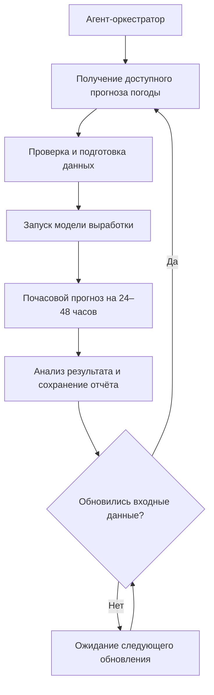

# Agentic AI для прогнозирования выработки ВЭС

Проект команды **ChachMechanics** для HackAlem AI: система прогнозирования почасовой выработки ветроэлектростанции на **24–48 часов** вперёд. Система должна самостоятельно получать прогнозы погоды, подготавливать данные, рассчитывать прогноз выработки, анализировать результат и повторять расчёт при обновлении входных данных.

**Статус:** репозиторий находится на этапе постановки задачи. Сейчас он содержит README; код, зависимости, данные и команды запуска ещё не добавлены. Ниже зафиксированы требования исходного ТЗ и предлагаемый план реализации. Описанная архитектура пока не реализована.

## Задача

Построить модель на исторических данных ВЭС и воспроизвести последовательное прогнозирование за февраль 2026 года так, как если бы система работала в тот момент. Это позволит оценить применимость решения для планирования выработки на ближайшие сутки и двое суток.

| Параметр | Требование ТЗ |
| --- | --- |
| Исторические данные | С марта 2023 года по 31 января 2026 года включительно |
| Тестовый период | С 1 по 28 февраля 2026 года включительно |
| Горизонт прогноза | 24–48 часов |
| Детализация результата | Почасовая |
| Погодные данные | Архивные прогнозы, доступные на соответствующий момент расчёта |
| Режим работы | Автоматический цикл с повторным расчётом при обновлении данных |

## Исходные данные

В ТЗ указаны две турбины:

- [Расположение турбины 1](https://maps.app.goo.gl/iN6svMt69D5qRpFU9).
- [Расположение турбины 2](https://maps.app.goo.gl/8UQMwsYavY6nLvFY8).

Предоставляемые исторические поля:

| Поле | Описание и единицы |
| --- | --- |
| Статистическое время | Временная отметка измерения |
| Средняя скорость ветра | м/с |
| Нормализированная активная мощность на стороне линии | Правило нормализации в ТЗ не указано |
| Средняя температура окружающей среды | °C |

Файлы данных в репозитории пока отсутствуют. До обучения необходимо уточнить часовой пояс, частоту измерений, способ привязки записей к турбинам, правило нормализации мощности и способ агрегирования результата по ВЭС.

В ТЗ задача названа прогнозированием выработки, но среди входных полей указана нормализированная мощность. Единицу целевого прогноза необходимо согласовать: перевод в МВт или МВт·ч требует сведений о масштабе нормализации и интервале времени.

## Историческое воспроизведение без утечки данных

Основное ограничение: при каждом расчёте можно использовать только информацию, которая была доступна на его момент.

1. На 31 января 2026 года сформировать первый прогноз на следующие 24–48 часов.
2. На 1 февраля сформировать новый прогноз на следующие 24–48 часов.
3. Последовательно повторять расчёт в течение тестового периода.
4. Оценивать прогнозы для целевых часов с 1 по 28 февраля включительно; точки за пределами этого периода исключать из итоговой оценки.

Для воспроизводимого эксперимента предлагается фиксировать время каждого запуска, выпуск погодного прогноза, момент его доступности, целевые часы и версию модели. Точное время ежедневного запуска и часовой пояс в ТЗ не заданы и должны быть определены в конфигурации эксперимента.

Правила подготовки и проверки данных:

- Использовать архив **прогнозов погоды**, а не наблюдения или реанализ, опубликованные позднее.
- Проверять, что выбранный выпуск погоды был доступен не позднее момента расчёта. Время выпуска и время доступности могут различаться.
- Строить лаги и скользящие признаки только по прошлым доступным измерениям.
- Обучать преобразования признаков и выбирать параметры модели без использования тестового периода.
- Разделять временной ряд хронологически; не перемешивать прошлые и будущие наблюдения случайным разбиением.
- Использовать фактические значения тестового периода для последующей оценки. Их использование при обновлении модели требует отдельного описания времени доступности и протокола обучения.
- При отсутствии нужного архива явно фиксировать пропуск или ошибку; не подменять прогноз фактической погодой.

## Предлагаемая архитектура

Выбор источников погоды, моделей, методов обработки и архитектуры агента по ТЗ остаётся за участниками. Следующая схема — план реализации.

| Компонент | Планируемая ответственность |
| --- | --- |
| Агент-оркестратор | Управлять состоянием запуска, вызывать инструменты, обрабатывать ошибки и инициировать повторный расчёт |
| Загрузка погоды | Получать архивные прогнозы по координатам и сохранять сведения об источнике и доступности |
| Подготовка данных | Проверять время, пропуски и дубликаты, согласовывать частоту рядов, формировать признаки |
| Модель | Прогнозировать целевую величину с почасовой детализацией |
| Анализ результата | Проверять полноту горизонта, пропуски, аномальные значения и согласованность с ограничениями данных |
| Хранилище результатов | Сохранять прогнозы, версии входов, параметры модели и журнал решений агента |

Агентный сценарий должен демонстрировать самостоятельное управление полным циклом и реакцию на обновления или ошибки. Числовой прогноз формирует модель; конкретные технологии и необходимость LLM-компонента будут определены при реализации.

## План моделирования и оценки

Предлагаемый порядок работы:

1. Проверить качество исторических данных и согласовать целевую величину.
2. Подготовить простой базовый прогноз для сравнения, например сохранение последнего доступного значения.
3. Обучить модель с погодными и временными признаками и проверить её на хронологической валидации до февраля 2026 года.
4. Зафиксировать модель и воспроизвести последовательные расчёты тестового периода.
5. Сопоставить прогнозы с фактическими значениями и сохранить отчёт.

Для внутренней оценки предлагаются MAE и RMSE в единицах согласованной целевой величины, отдельно по дальности прогноза. Это предлагаемые метрики, а не установленные в ТЗ метрики организаторов. Численные результаты пока отсутствуют.

Для перекрывающихся прогнозов необходимо заранее определить правило оценки: сохранять каждый запуск отдельно и сравнивать прогнозы при одинаковой дальности, не выбирать задним числом наиболее удачный прогноз на один и тот же час.

## Формат результата

Предлагаемый формат экспорта — таблица CSV с одной строкой на целевой час и объект прогнозирования. Это проектный контракт, который потребуется уточнить по данным и требованиям сдачи.

| Поле | Назначение |
| --- | --- |
| `forecast_origin` | Момент расчёта прогноза с часовым поясом |
| `target_time` | Целевой час с часовым поясом |
| `horizon_hours` | Дальность прогноза относительно момента расчёта |
| `asset_id` | Идентификатор турбины или ВЭС согласно принятому уровню агрегации |
| `prediction` | Прогноз в согласованных единицах |
| `weather_issue_time` | Время выпуска использованного прогноза погоды |
| `weather_available_at` | Момент, когда этот прогноз стал доступен |
| `model_version` | Версия модели |
| `run_id` | Идентификатор запуска для связи с журналом и конфигурацией |

При повторном расчёте следует сохранять отдельную версию результата, чтобы оставалась возможность восстановить первоначальный прогноз и причину обновления.

## Запуск и воспроизводимость

**Запустить систему пока нельзя:** в репозитории отсутствуют исходный код, конфигурация и зависимости. Стек и поставщик погодных данных ещё не выбраны.

Перед сдачей решения этот раздел необходимо дополнить проверенными инструкциями:

- Поддерживаемые версии среды выполнения и установка зафиксированных зависимостей.
- Размещение входных файлов, схема данных и настройка координат, времени и горизонта.
- Источник архивных погодных прогнозов, порядок доступа и настройка ключей через переменные окружения, если они потребуются.
- Команды подготовки данных, обучения, одиночного прогноза и воспроизведения февраля 2026 года.
- Команда запуска агентного цикла и сценарий повторного расчёта при обновлении входов.
- Пути к результатам и журналам, команда расчёта метрик и ожидаемый формат отчёта.
- Зафиксированные параметры эксперимента, версии моделей и снимки либо идентификаторы входных данных.

Ключи доступа не должны попадать в репозиторий. Условия распространения исходных данных и погодных архивов необходимо проверить перед их добавлением.

## Критерии оценки HackAlem AI

| Критерий из ТЗ | Баллы |
| --- | ---: |
| Соответствие задаче и работоспособность | 25 |
| Техническая реализация | 25 |
| README и воспроизводимость | 25 |
| Ценность и применимость решения | 15 |
| Потенциал развития и оригинальность подхода | 10 |
| **Итого** | **100** |

## План работ

- [x] Зафиксировать требования ТЗ в README.
- [ ] Получить данные и проверить их структуру, временные отметки и единицы.
- [ ] Выбрать источник с доступными архивами погодных прогнозов за нужный период.
- [ ] Реализовать подготовку данных и базовую модель.
- [ ] Реализовать основную модель и хронологическую валидацию.
- [ ] Реализовать агентный цикл, обработку ошибок и повторные расчёты.
- [ ] Воспроизвести прогнозирование за 1–28 февраля 2026 года.
- [ ] Добавить проверенные команды запуска, результаты и отчёт об оценке.

Источник требований: ТЗ «Кейс: Agentic AI для прогнозирования выработки ВЭС». Предлагаемые архитектура, метрики и формат экспорта уточняются по мере реализации.
